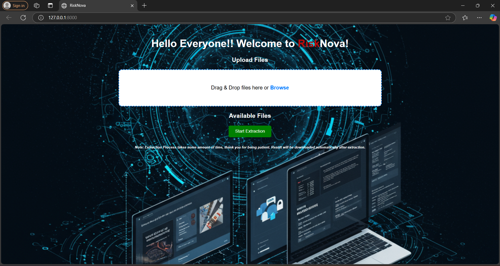
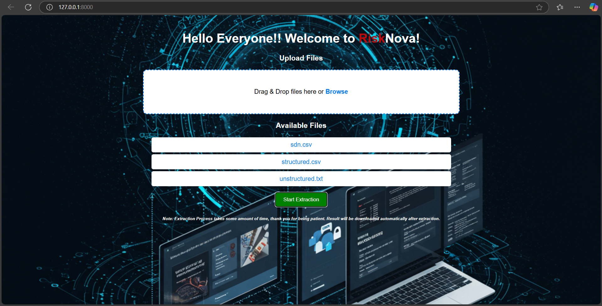
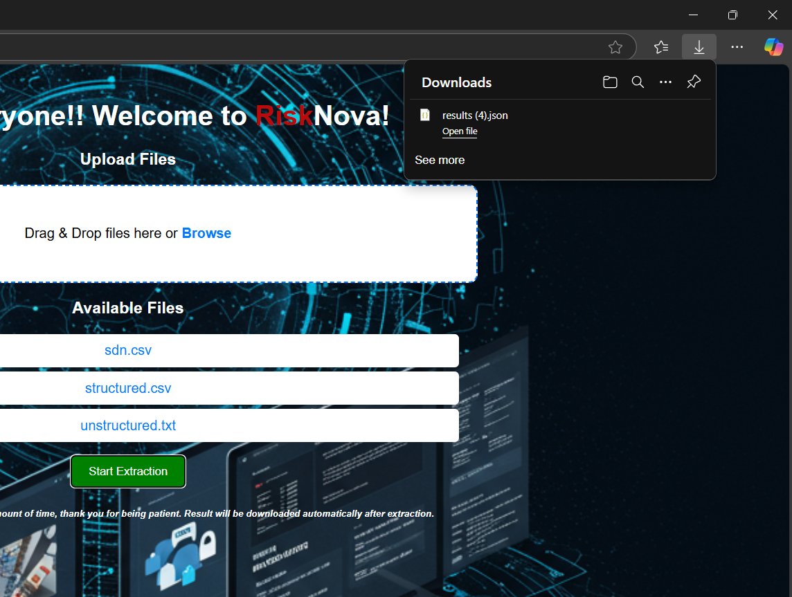

# 🚀 RiskNova

## 📌 Table of Contents
- [Introduction](#introduction)
- [Demo](#demo)
- [Inspiration](#inspiration)
- [What It Does](#what-it-does)
- [How We Built It](#how-we-built-it)
- [Challenges We Faced](#challenges-we-faced)
- [How to Run](#how-to-run)
- [Tech Stack](#tech-stack)
- [Team](#team)

---

## 🎯 Introduction
Technology Hackathon

### Al-Driven Entity Intelligence Risk Analysis

Challenge Overview

Develop a sophisticated Generative AI/ML powered system that automates the research and evidence-gathering process for identifying, verifying, and risk-scoring entities (corporations, non-profits, shell companies, and financial intermediaries) from complex, multi-source transaction data. The solution should significantly reduce manual effort for data analysts, improve accuracy, and provide a robust risk evaluation mechanism.

Problem Statement:

Currently, data analysts spend significant manual effort analyzing party names from transaction details to determine the correct entities involved. This process becomes even more challenging when dealing with corporations, non-profits, and potential shell companies due to naming inconsistencies, abbreviations, fraudulent entities, and lack of structured information. The goal of this challenge is to build an Al-driven system that:

Extracts entity names from unstructured and structured transaction data.

Enriches the extracted names with publicly available data (e.g., company

registries, online sources, financial news, regulatory filings, and legal databases). Identifies potential fraudulent or high-risk entities through anomaly detection.

Classifies entities into categories (corporation, non-profit, shell company, government agency, etc.).

Assigns a risk score based on entity attributes, and associated networks (business/sectors associated with the entities).

Provides supporting evidence and confidence scores to assist analysts in decision- making.
## 🎥 Demo
🔗 [PPT Presentation](./artifacts/demo/AI_Driven_Entity_Intelligence_Risk_Analysis_Video.mp4) (Added PPT)  
📹 [Video Demo](./artifacts/demo/AI_Driven_Entity_Intelligence_Risk_Analysis_Video.mp4) (Added Video)  

🖼️ Screenshots:







## 💡 Inspiration
The idea for this project stems from the increasing complexity of financial transactions and the growing need for AI-driven automation in fraud detection, compliance, and risk assessment. In financial ecosystems, identifying high-risk entities—such as shell companies, fraudulent organizations, and intermediaries—is a major challenge.

Many financial institutions, auditors, and compliance officers still manually analyze transaction data, cross-referencing multiple sources to verify entities. This is not only time-consuming but also error-prone, leading to missed risks or false positives.

## ⚙️ What It Does
### Entity Extraction & Name Resolution
Feature: Extracts entity names from structured and unstructured transaction data.
Functionality: Uses Named Entity Recognition (NER) models to identify company names, people, and intermediaries. Handles name variations, abbreviations, and fuzzy matching to resolve inconsistencies.

### Data Enrichment & Verification
Feature: Enhances extracted entities with publicly available datasets.
Functionality:Integrates with APIs like OpenCorporates, Wikidata, SEC EDGAR, and OFAC Sanctions List.
Scrapes financial news and legal databases to gather additional risk indicators.

### Risk Classification & Anomaly Detection
Feature: Identifies fraudulent or high-risk entities based on known patterns.
Functionality:Implements Machine Learning models (Random Forest, XGBoost, or GNNs) for anomaly detection.
Flags shell companies, politically exposed persons (PEPs), and sanctioned entities.

### Risk Scoring Mechanism
Feature: Assigns a risk score (0 to 1) based on entity attributes and associated networks.
Functionality:Considers factors such as ownership structure, financial transactions, and past fraud history.Uses a weighted scoring system to prioritize risk levels.

### API & Output Format
Feature: Exposes an API endpoint for external integration.
Functionality:Provides responses in JSON/CSV format with extracted entities, risk scores, and supporting evidence.

## 🛠️ How We Built It
### Tech Stack & Frameworks
Programming Languages: Python (Backend & AI/ML), JavaScript (Frontend)
Machine Learning Frameworks: TensorFlow, PyTorch, Scikit-learn
Natural Language Processing: NLP
Large Language Model: LLM

### Data Extraction & Processing
Libraries: pandas, NumPy, regex, PyTorch

### Entity Classification & Risk Scoring
Models Used: Random Forest, XGBoost, GNN (Graph Neural Networks) for anomaly detection

### Risk Scoring: Weighted algorithm combining entity type, ownership structure, past fraud records, and financial behavior

## 🚧 Challenges We Faced
### Data Enrichment & API Rate Limits
Implemented caching mechanisms and parallel API requests to optimize data retrieval.

### Generating Explainable Risk Scores
AI models provided risk scores, but lacked interpretability for analysts.
LLM-powered textual justifications to enhance transparency.

## 🏃 How to Run
1. Clone the repository  
   ```sh
   git clone https://github.com/ewfx/aidel-ciphers.git
   ```
2. Install dependencies  
   ```sh
   pip install -r requirements.txt (for Python)
   ```
3. Run the project  
   ```sh
   python app.py
   ```

## 🏗️ Tech Stack
- 🔹 Frontend: React 
- 🔹 Backend: Flask / Python
- 🔹 Other: PyTorch API / Pandas / Numpy

## 👥 Team
- **Ashritha Nagandla** - [GitHub](https://github.com/Ashritha-01) | [LinkedIn](#)
- **Hyma Lakshmi Nelluri** - [GitHub](https://github.com/hyma09) | [LinkedIn](#)
- **Tamojit Das** - [GitHub](https://github.com/tamojit2000) | [LinkedIn](https://www.linkedin.com/in/tamojit-das-ab425b228/)
